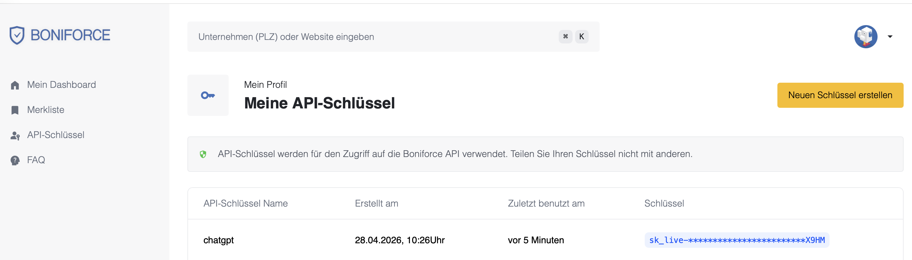

# Boniforce for ChatGPT & Claude

**Bring instant German credit checks and sector intelligence straight into your AI chat.**

Ask ChatGPT or Claude *"What's the Boniscore of Müller GmbH — and how is the
construction sector doing?"* and get a real answer — pulled live from
[Boniforce](https://api.boniforce.de) and
[Sectorbench](https://sectorbench.theaiwhisperer.cloud) — in seconds. No
tab-switching, no copy-paste, no extra logins.

---

## What you get

🔍 **Search any German company by name** — Claude finds the register entry for
you, no manual HRB lookup.

📊 **Boniscore + credit-limit recommendation on demand** — score from 0–100,
APPROVE / REVIEW / DECLINE verdict, conservative + balanced + aggressive
credit-limit scenarios.

📑 **Drill into the numbers** — balance-sheet history (Eigenkapital,
Verbindlichkeiten, Bilanzsumme…) and per-year financial ratios, all from
Bundesanzeiger filings.

⚡ **Works mid-conversation** — the model decides when to call Boniforce, so
you can ask follow-ups in plain language: *"Compare it to last year"*,
*"Should I raise the limit?"*, *"Spit out an email to the customer."*

🏭 **German sector intelligence** — current branch-health score (0–100),
12-month trend, monthly news briefing, and Destatis insolvency series
for 10 sectors (Automotive, Construction, Healthcare, Renewable Energy,
Logistics, FinTech, IT Services, Retail, Hospitality, Manufacturing).
Sourced from Destatis, Eurostat, and Bundesbank via Sectorbench.

🔐 **Your data stays yours** — the connector uses your personal Boniforce
API key. We never see passwords. Revoke access in one click from your
Boniforce dashboard. Sector data uses a shared operator token, invisible
to you.

---

## Get your Boniforce API key

You'll need this once, when you first connect.

1. Log in to your **Boniforce account** at [boniforce.de](https://boniforce.de).
2. In the left sidebar click **API-Schlüssel**.
3. Click the yellow button **"Neuen Schlüssel erstellen"** in the top-right.
4. Give it a name (e.g. `chatgpt` or `claude`) and confirm.
5. **Copy the full key now** — it starts with `sk_live-…` and is shown only once.



Treat the key like a password. You can revoke or rotate it any time on the
same page; revoking immediately disconnects the AI assistant.

## Connect

The Boniforce-hosted server is at:

```
https://mcp.boniforce.de/mcp
```

### Add to Claude (Claude.ai web or Claude Desktop)

1. Open **Settings → Connectors → Add custom connector**.
2. Paste the URL above.
3. A browser window opens — paste your **Boniforce API key**. Done.

### Add to ChatGPT (Pro, Plus, Business, Enterprise, Education)

ChatGPT's custom MCP connectors are in **beta** and live behind Developer Mode.
You need to enable it once:

1. **chatgpt.com → Settings → Apps & Connectors**.
2. **Erweiterte Einstellungen → Entwicklermodus** (Advanced settings → Developer mode) → toggle **on**.
3. Back at the top of *Apps & Connectors*, click **App erstellen** (Create app).
4. Fill the form:
   - **Name**: `Boniforce`
   - **Beschreibung** *(optional)*: e.g. *Sofort-Bonitätsprüfungen für deutsche Firmen — Boniscore, Kreditlimit, Bilanzanalyse.*
   - **URL des MCP-Servers**: `https://mcp.boniforce.de/mcp` *(the `/mcp` suffix is required — ignore the `/sse` placeholder)*
   - **Authentifizierung**: **OAuth** *(leave Erweiterte OAuth-Einstellungen closed — auto-discovery handles it)*
5. Save → a browser window opens → paste your **Boniforce API key**. Done.

> Custom connectors are currently **web-only** in ChatGPT and not yet exposed
> on the free tier.

### Build a public Custom GPT (per-user keys)

Want a public GPT in the ChatGPT directory that other users can adopt — but
**each user uses their own Boniforce API key**? The same server exposes a
REST mirror at `https://mcp.boniforce.de/api/v1/*` plus an OpenAPI spec, so
you can wire it into a Custom GPT's *Aktionen* panel.

1. Get an OAuth client for ChatGPT (one-off, on the server):

   ```bash
   docker exec -it boniforce-mcp boniforce-mcp register-gpt-client \
     --name "ChatGPT Boniforce GPT" \
     --redirect-uri "https://chatgpt.com/aip/<your-gpt-id>/oauth/callback"
   ```

   Copy `client_id` + `client_secret` from the output.

2. In **chatgpt.com → GPTs erkunden → Erstellen → Konfigurieren → Aktionen hinzufügen**:

   | Field | Value |
   |---|---|
   | Authentifizierung | **OAuth** |
   | Client ID | from CLI |
   | Client Secret | from CLI |
   | Authorization URL | `https://mcp.boniforce.de/oauth/authorize` |
   | Token URL | `https://mcp.boniforce.de/oauth/token` |
   | Scope | `mcp` |
   | Token Exchange Method | **POST request body** (`client_secret_post`) |
   | Schema → "Von URL kopieren" | `https://mcp.boniforce.de/api/openapi.json` |
   | Privacy-Policy-URL | `https://boniforce.de/datenschutz` |

3. Save → publish (Nur ich / Mit Link / Öffentlich).

**Branch-level sector data** for 10 German industries (automotive,
construction, healthcare, fintech, …) — current health scores, 12-month
score history, AI-summarised monthly news reports, and Destatis insolvency
trends — is also surfaced, powered by
[Sectorbench](https://sectorbench.theaiwhisperer.cloud). Available **both
through MCP** (Claude.ai connector + ChatGPT MCP connector) **and** via the
Custom GPT OpenAPI schema. Same OAuth flow as the credit-data tools; the
upstream Sectorbench call uses an operator-issued bearer token configured
on the server (`BF_SECTORBENCH_TOKEN`), so end users don't need a separate
Sectorbench key. Try: *"Show me the construction sector's health score and
the latest monthly outlook."*

End-user flow inside the public GPT:

> User opens the GPT → asks a question → ChatGPT redirects to our
> `/oauth/authorize` page → user pastes their **own** Boniforce API key →
> token issued, stored per-user by ChatGPT → all subsequent calls use that
> user's key. Same per-user isolation as the MCP connector path.

### Try it

The Boniforce tools now appear in your chat sidebar. Sample prompts:

> *"Erstelle mir einen Boniforce-Bericht für die Boniforce GmbH und gib mir Score und Kreditlimit."*

> *"Search Boniforce for SAP SE and tell me the latest score."*

> *"List the last five reports I generated."*

> *"Wie ist die aktuelle Lage in der Bauwirtschaft? Score, Trend, Insolvenzen."*

> *"Give me the construction sector outlook and compare it to manufacturing."*

> *"Boniscore für Müller GmbH plus Branchen-Briefing für Logistik."*

---

## Frequently asked

**Do I need a separate password for the connector?**
No. Your Boniforce API key is the only credential. We validate it against
your Boniforce account when you paste it; that's it.

**Where do I get my API key?**
Log in to your Boniforce dashboard. The key starts with `sk_live-…`. If you
don't have one yet, contact your Boniforce admin.

**How long does a credit check take?**
A new report typically completes in **30–120 seconds** (the system pulls and
analyses Bundesanzeiger filings on demand). The model polls automatically
and tells you when it's ready.

**Will my chat history be sent to Boniforce?**
No. The model only sends Boniforce the company identifiers it needs (name +
HRB number). Your conversation stays between you and Anthropic / OpenAI.

**Can I revoke access?**
Yes — anywhere your Boniforce key can be rotated. As soon as the key is
invalidated, the connector stops working until you paste a new one.

**Does it work on the free Claude / free ChatGPT plans?**
Custom connectors are paid-tier features.
- **Claude**: paid Claude.ai plans (web + desktop).
- **ChatGPT**: Pro, Plus, Business, Enterprise, Education on
  [chatgpt.com](https://chatgpt.com) — currently in beta and gated behind
  *Settings → Apps → Advanced settings → Developer mode*.

**Can my whole team share one MCP server?**
Yes. Each teammate adds the same URL `https://mcp.boniforce.de/mcp` and
pastes their own Boniforce API key. Their data is isolated by API-key
identity — no shared sessions.

---

## What you can ask the AI to do

| Plain-English ask                                            | What happens under the hood |
|--------------------------------------------------------------|------------------------------|
| *"Find Müller GmbH on Boniforce."*                           | `search_companies`          |
| *"Get me the Boniscore for HRB 12345 in München."*           | `create_report` → `get_job_status` (poll) → `get_report` |
| *"Show me the balance-sheet history."*                       | `get_report_financial_data` |
| *"What's the equity ratio trend the last three years?"*      | `get_report_financial_analysis` |
| *"Which reports did I generate this week?"*                  | `list_reports`              |
| *"How is the construction sector doing?"*                    | `get_branch` (sector score) |
| *"Give me the latest news briefing for automotive."*         | `get_branch_news`           |
| *"Show me 12 months of insolvencies in retail."*             | `get_branch_insolvency_history` |
| *"Rank all 10 German sectors by health score."*              | `get_branch_ranking`        |

The agent picks the right tool sequence on its own — you just describe what
you want in plain language (German or English).

---

<details>
<summary><strong>For developers / IT — self-hosting, internals, source code</strong></summary>

This repo is the open-source server behind `mcp.boniforce.de`. You can run
your own instance for private routing, custom OAuth, or development.

### Architecture

```
ChatGPT / Claude  ──HTTPS──▶  reverse proxy (Caddy or Traefik)
                                   │
                                   ▼
                              FastMCP server (Python 3.11)
                                   │
                                   ├─ OAuth 2.1 + DCR + PKCE     (auth.py)
                                   ├─ MCP Streamable HTTP        (server.py)
                                   ├─ REST + OpenAPI mirror      (rest_api.py)
                                   ├─ Boniforce httpx wrapper    (boniforce_client.py)
                                   ├─ Sectorbench httpx wrapper  (sectorbench_client.py)
                                   └─ SQLite + Fernet            (storage.py, crypto.py)
                                   │
                ┌──────────────────┼─────────────────────────────┐
                ▼                                                ▼
       api.boniforce.de                       sectorbench.theaiwhisperer.cloud
       (per-user sk_live key)                 (shared sbk_ operator token)
```

The Boniforce API key submitted by a user is validated against
`api.boniforce.de`, then encrypted at rest. The user identifier is
`sha256(token)` — same key on a different device = same MCP user.

### Tools exposed via MCP

Boniforce credit-data tools (require a per-user `sk_live-…` key linked via
the OAuth flow):

| Tool                              | HTTP                                                            |
|-----------------------------------|-----------------------------------------------------------------|
| `search_companies`                | `GET /v1/search`                                                |
| `list_reports`                    | `GET /v1/reports`                                               |
| `create_report`                   | `POST /v1/reports`                                              |
| `get_report`                      | `GET /v1/reports/{report_id}`                                   |
| `get_job_status`                  | `GET /v1/jobs/{job_id}/status`                                  |
| `get_report_financial_data`       | `GET /v1/reports/{report_id}/financial_data`                    |
| `get_report_financial_analysis`   | `GET /v1/reports/{report_id}/financial_data/analysis`           |

Sectorbench branch-data tools (JWT-gated; upstream call uses the operator's
shared `BF_SECTORBENCH_TOKEN` — end users do **not** need a Sectorbench key):

| Tool                              | Sectorbench HTTP                                                |
|-----------------------------------|-----------------------------------------------------------------|
| `list_branch_scores`              | `GET /api/v1/scores`                                            |
| `get_branch_ranking`              | `GET /api/v1/scores/ranking`                                    |
| `get_branch`                      | `GET /api/v1/branches/{branch_key}`                             |
| `get_branch_history`              | `GET /api/v1/branches/{branch_key}/history?months=12`           |
| `get_branch_news`                 | `GET /api/v1/branches/{branch_key}/news`                        |
| `get_branch_insolvency_history`   | `GET /api/v1/branches/{branch_key}/insolvency/history?months=12`|
| `get_branch_indicator_history`    | `GET /api/v1/branches/{branch_key}/indicators/{indicator_key}/history` |
| `list_branch_indicators`          | `GET /api/v1/indicators`                                        |
| `get_sectorbench_meta`            | `GET /api/v1/meta`                                              |

### Sectorbench REST endpoints (Custom GPT Actions surface)

Same data, REST-shaped for ChatGPT Custom GPT Actions which speak OpenAPI 3.1
rather than MCP. Spec at `/api/openapi.json`. Same JWT auth as `/mcp`.

| operationId                  | HTTP                                                                  |
|------------------------------|-----------------------------------------------------------------------|
| `listBranchScores`           | `GET /api/v1/branches`                                                |
| `getBranchRanking`           | `GET /api/v1/branches/ranking`                                        |
| `getBranch`                  | `GET /api/v1/branches/{branch_key}`                                   |
| `getBranchHistory`           | `GET /api/v1/branches/{branch_key}/history?months=12`                 |
| `getBranchNews`              | `GET /api/v1/branches/{branch_key}/news`                              |
| `getBranchInsolvencyHistory` | `GET /api/v1/branches/{branch_key}/insolvency/history?months=12`      |
| `getBranchIndicatorHistory`  | `GET /api/v1/branches/{branch_key}/indicators/{indicator_key}/history`|
| `listIndicators`             | `GET /api/v1/indicators`                                              |
| `getSectorbenchMeta`         | `GET /api/v1/sectorbench/meta`                                        |

`branch_key` ∈ `automotive | healthcare | construction | renewable_energy | logistics | fintech | it_services | retail | hospitality | manufacturing`. In-memory TTL cache (default 600s) shields the shared 600 req/h Sectorbench quota.

### Quick deploy (Docker + Caddy)

Requirements: Linux host, Docker + Compose, public domain pointing at the host.

```bash
git clone https://github.com/Caohung77/boniforce-mcp
cd boniforce-mcp/deploy

sed -i 's/mcp\.your-domain\.tld/your.domain.tld/' Caddyfile

cat > ../.env <<EOF
BF_ISSUER_URL=https://your.domain.tld
BF_DB_PATH=/var/lib/boniforce-mcp/db.sqlite
BF_ENCRYPTION_KEY=$(docker run --rm python:3.11-slim sh -c "pip install -q cryptography && python -c 'from cryptography.fernet import Fernet; print(Fernet.generate_key().decode())'")
BF_OAUTH_SIGNING_KEY="$(docker run --rm python:3.11-slim sh -c "pip install -q cryptography && python -c 'from cryptography.hazmat.primitives import serialization as s; from cryptography.hazmat.primitives.asymmetric import rsa; k=rsa.generate_private_key(65537,2048); print(k.private_bytes(s.Encoding.PEM,s.PrivateFormat.PKCS8,s.NoEncryption()).decode().replace(chr(10), chr(92)+chr(110)), end=\"\")'")"
BF_API_BASE=https://api.boniforce.de
BF_HOST=0.0.0.0
BF_PORT=8000
# Optional — enables the Sectorbench branch-data endpoints under /api/v1/branches/*
# Leave empty to disable (those endpoints will return 503).
BF_SECTORBENCH_TOKEN=
EOF
chmod 600 ../.env

docker compose up -d --build
```

Connector URL: `https://your.domain.tld/mcp`. Users self-provision on first
connect — no admin commands.

### Behind an existing Traefik

```bash
MCP_HOST=mcp.your-domain.tld \
docker compose -f deploy/docker-compose.traefik.yml up -d --build
```

The compose file registers a `Host(${MCP_HOST})` router on the existing
`traefik-public` network with the `letsencrypt` cert resolver.

### Local development

```bash
python3.11 -m venv .venv && . .venv/bin/activate
pip install -e ".[dev]"
pytest                        # 10 tests
uvicorn boniforce_mcp.server:app --port 8000
npx @modelcontextprotocol/inspector http://localhost:8000/mcp
```

### Endpoints

| Path                                           | Purpose                                |
|------------------------------------------------|----------------------------------------|
| `/mcp`                                         | MCP Streamable HTTP transport          |
| `/.well-known/oauth-authorization-server`      | OAuth 2.1 metadata (RFC 8414)          |
| `/.well-known/oauth-protected-resource`        | Protected resource metadata (RFC 9728) |
| `/oauth/register`                              | Dynamic Client Registration (RFC 7591) |
| `/oauth/authorize`                             | OAuth authorization (PKCE)             |
| `/oauth/login`                                 | API-key validation form                |
| `/oauth/token`                                 | Token endpoint                         |
| `/jwks.json`                                   | JSON Web Key Set                       |

### Security model

* The Boniforce API key is the only user credential. Validated against
  `api.boniforce.de` on every connect, stored Fernet-encrypted in SQLite.
* User identity = `sha256(token)`. Same key on a different device = same user.
* OAuth access tokens: short-lived (1 h) RS256 JWTs, audience-bound to the
  canonical MCP resource URL. Refresh tokens: opaque, single-use, hashed.
* PKCE mandatory (`S256`); `plain` rejected per OAuth 2.1.
* TLS terminated at the reverse proxy; the application listens only on the
  internal port.

### Tests

```bash
pytest
```

Covers the httpx client (mocked Boniforce backend), the full OAuth 2.1 PKCE
flow including DCR + refresh, invalid-token rejection, PKCE failure
rejection, and JWKS shape.

</details>

---

## License

[MIT](LICENSE).

## Contact

Issues + PRs welcome here. For Boniforce account questions or partnerships:
contact your Boniforce account manager.
