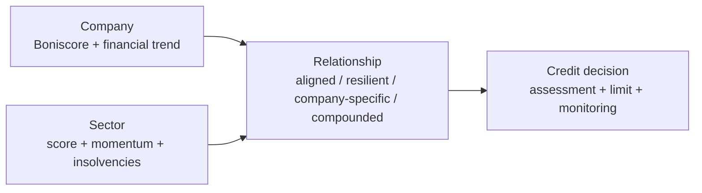

# Decision-brief output format

Render only sections supported by returned data. Replace bracketed placeholders with actual values; never print placeholder text.

## Default Markdown structure

```markdown
# Credit Intelligence — [legal company name]

> **[APPROVE / REVIEW / DECLINE]** · Boniscore **[score]/100** · Suggested limit **[€ amount]**<br>
> Sector **[label]** · Sector score **[score]/100** · Rank **[rank]/10**

## Executive view

| Company | Relationship | Sector |
|---|---|---|
| `[████████░░] [score]/100` | **[relationship class]** | `[██████░░░░] [score]/100` |
| [company label] | [one-sentence synthesis] | [risk level], [trend] |

**Why:** [2–4 evidence-backed drivers].

## Financial trajectory

| Metric | [oldest FY] | [middle FY] | [latest FY] | Direction | Interpretation |
|---|---:|---:|---:|---|---|
| Net income | ... | ... | ... | ↗/→/↘ | ... |
| Equity | ... | ... | ... | ... | ... |
| Liabilities | ... | ... | ... | ... | ... |
| Liquidity | ... | ... | ... | ... | ... |
| Equity ratio | ... | ... | ... | ... | ... |

`Financial health  [sparkline]  [oldest] → [latest]`

## Sector environment

| Signal | Current | 12-month direction | Relevance to company |
|---|---:|---|---|
| Health score | ... | [sparkline, delta] | ... |
| Insolvency cases | ... | [sparkline, delta] | ... |
| Weakest dimension | ... | ... | ... |
| Current driver | ... | ... | ... |

## Decision and monitoring

- **Decision:** [repeat the returned Boniforce assessment and limit].
- **Primary strength:** [...].
- **Primary risk:** [...].
- **Monitor:** [2–3 measurable signals with a timeframe].

<sub>Company report: [date] · Financial years: [range] · Sector data: [fetched_at]. Decision support, not a guarantee.</sub>
```

## Visual rules

- Create a 10-segment score bar by rounding the actual 0–100 score to filled segments: `█` filled and `░` empty. Always print the number beside it.
- Create a sparkline from an ordered numeric series using `▁▂▃▄▅▆▇█`. If fewer than two valid values exist, print `n/a`.
- Show `↗`, `→`, or `↘` only after comparing actual first and last values. Include the numeric delta where meaningful.
- Use German number formatting in German responses and English formatting in English responses. Preserve the source currency.
- Keep tables narrow. Put detailed Aktiva/Passiva/GuV fields in a collapsed or follow-up section rather than the executive view.
- Do not use color alone to communicate risk. Pair any emoji or badge with text.
- If sector context is unavailable and was not explicitly requested, omit the sector line, relationship column, sector section, and sector footer fields silently. Do not end with an explanation of missing WZ data.
- If a financial metric is unavailable, omit its row unless its absence materially limits the credit decision. Do not list optional omitted content or invite the user to request it.
- Start with the finished assessment. Never include internal workflow commentary in the final result.

## Optional Mermaid relationship diagram

Use only when Mermaid rendering is supported and the relationship is materially easier to understand visually:



Replace generic labels with concise actual values. Do not add a Mermaid diagram when the three-column executive table already communicates the result.
